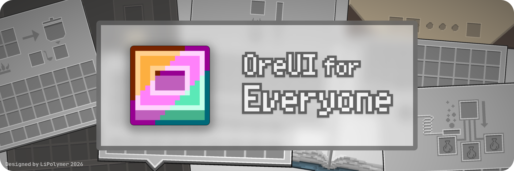

<div align="center">
  <h1>OreUI For Everyone-Forked</h1>

  
  
  [](LICENSE)

  <p><strong>让更多模组拥有统一、清爽的 AE2 OreUI 风格。这是它的高版本移植，官方裁切器裁切。</strong></p>
  <p>面向 Minecraft Java Edition 1.21+ 的模组界面资源包。</p>
</div>

## 简介

**OreUI For Everyone** 将 [Applied Energistics 2（AE2）](https://modrinth.com/mod/ae2) 的 OreUI 视觉风格移植到原版与其他模组的界面中，让整合包里的按钮、槽位、面板和交互界面保持更统一的观感。

当前项目覆盖 Create、Mekanism、Thermal Series、JEI、FTB 系列、Patchouli、Tinkers' Construct 等常用模组及其附属。

> [!NOTE]
> 实际显示效果取决于所安装的模组与版本，完整适配及贡献记录请查看 [`contributor.txt`](contributor.txt)。 

## 安装

1. 从 [CurseForge](https://www.curseforge.com/minecraft/texture-packs/oreui-for-everyone) 或 [Modrinth](https://modrinth.com/resourcepack/oreuife) 下载适用于 Minecraft 1.20.1 的版本。
2. 将下载的压缩包放入 `.minecraft/resourcepacks` 目录，无需解压。
3. 在游戏中打开「选项 → 资源包」，启用 **OreUI For Everyone**。
4. 如果同时使用其他会修改 GUI 的资源包，请将本资源包置于更高优先级。

## 构建本项目

在 Windows 上克隆仓库并运行打包脚本：

```powershell
git clone https://github.com/ReConstruction-127/OreUI-For-Everyone-1.20.1.git
cd OreUI-For-Everyone-1.20.1
.\AutoPacking.bat
```

构建产物将输出至 `build/OreUI-For-Everyone-1.20.1.zip`。

## 参与贡献

欢迎适配更多模组或完善现有纹理：

1. Fork 本仓库并创建分支。
2. 将适配资源放入 `assets/<mod_id>/` 对应路径。
3. 在 [`contributor.txt`](contributor.txt) 中填写你的名字、模组 ID 与贡献内容。
4. 确认资源路径及界面显示无误后提交 Pull Request。

问题反馈与建议请前往 [Issues](https://github.com/ReConstruction-127/OreUI-For-Everyone-1.20.1/issues)。

## 相关项目

- [OreUI-For-Everyone-1.21.1](https://github.com/LiPolymer/OreUI-For-Everyone-1.21.1) [`GitLab`](https://gitlab.com/LiPolymer/OreUI-For-Everyone-1.21.1) - 本项目的 1.21+ 支持, 采用补丁形式存储 
    - 正式构建可在 OreUI-For-Everyone 的 Modrinth / CurseForge 页面获取, 测试构建请前往 [GitLab Pipelines](https://gitlab.com/LiPolymer/OreUI-For-Everyone-1.21.1/-/pipelines)
- [OreUI-For-Everyone-forked](https://github.com/RyanLuoJiayuan1120/OreUI-For-Everyone-forked) - 本项目
- [OreUIForEveryone-1.21.1-Extended](https://github.com/OnDreamQwQ/OreUIForEveryone-1.21.1-Extended) - 适用于1.21.1版本的 OreUI 扩展包（已包含，但建议覆盖）

> [!TIP]
> 关于适用于Windows10/11的OreUI For Windows ，请见 [OreUI For Windows](https://github.com/ReConstruction-127/OreUI-For-Windows)

## 致谢

感谢 **Re_Construction、Delta、AL、jihan_hanhan** 以及所有参与测试、反馈和适配工作的贡献者。详细贡献记录见 [`contributor.txt`](contributor.txt)。

## 许可证

本项目基于 [GNU Affero General Public License v3.0](LICENSE) 开源。

---